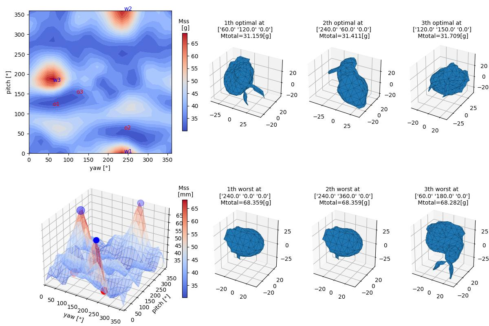
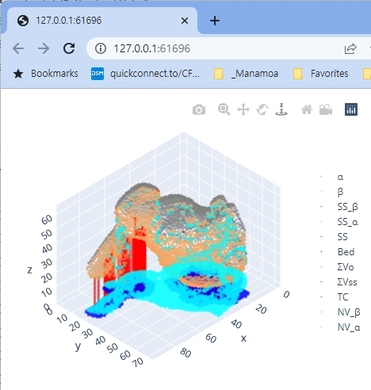

# tomo_TSE2023
support structure tomography, modified version submitted for Textile Science Engineering (2023)

#### 1. Download and upzip all the files of this repository to your PC ("Code"->"Download Zip")

#### 2. Install software
#####    (1) Install Visual Studio Code (VSCode)
#####    (2) Install Python 3 (preferably Version 3.7.8)
#####    (3) Install Python packages using "requirements.txt".
```
pip install -r requirements.txt
```

혹시 패키지 설치가 잘 안될 경우에는, requirements.txt안에 적힌 각 패키지를 하나씩 설치하세요.

```
pip install numpy==1.21.4
```

#####    (4) Install VC++ 2015, 2017, 2019, and 2022 Redistributable package
( https://learn.microsoft.com/en-us/cpp/windows/latest-supported-vc-redist?view=msvc-170 ).

#### 3. Open the downloaded folder in VSCode (Main menu->"File"->"Open Folder"). 

#### 4. Modify  mesh filename,  initial orientation and angle interval(=theta_YP) in "tomo_TSE2023.py".  Run the "tomo_TSE2023.py" (shortcut key, F5)

#####    (1) To search optimal orientation, input "theta_yp" value as "360 / N " (where N = integer).
```
#=========================================================================================
DataSet= [( 'MeshData\\(4)Bunny_69k.stl', 0, 0, 0)
theta_YP = 30
#=========================================================================================
```


#####    (2) To see the support structure information for the given (yaw, pitch, roll), set "theta_YP" as zero.
```
#=========================================================================================
DataSet= [( 'MeshData\\(4)Bunny_69k.stl', 60, 120, 0) #1st optimal of Bunny
theta_YP = 0
#=========================================================================================
```


